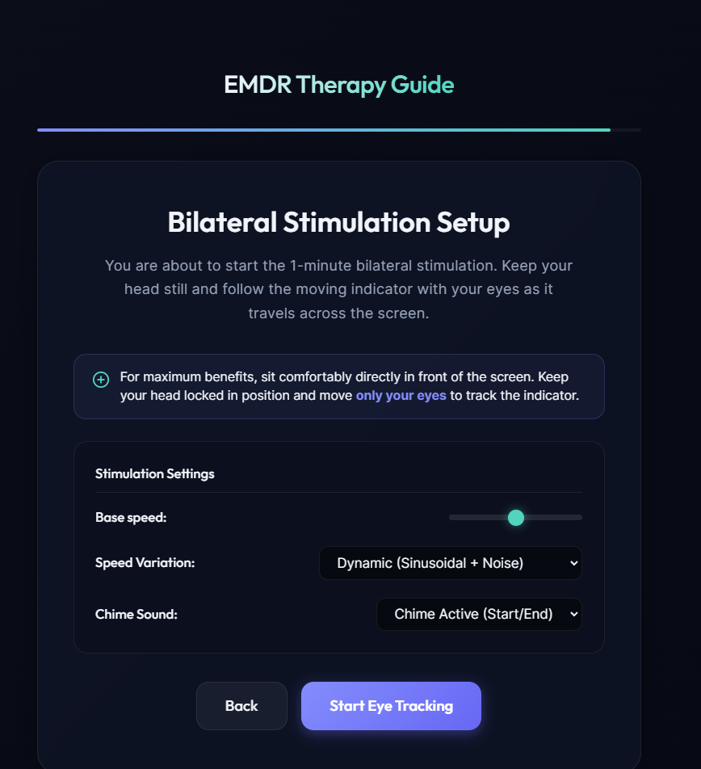
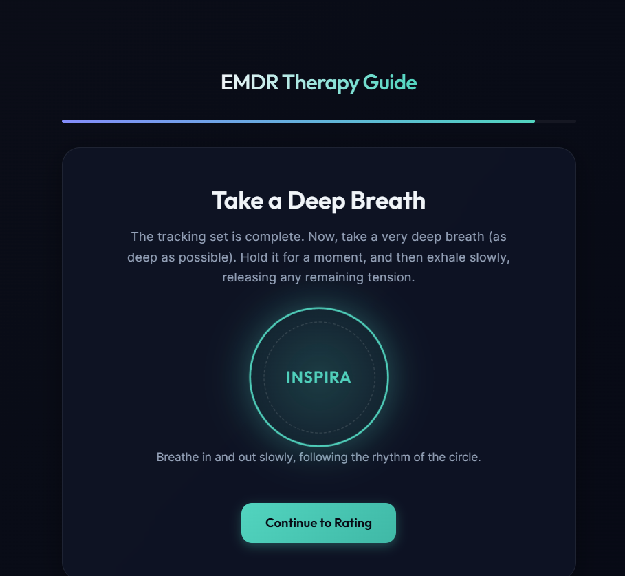

# EMDR Therapy Guide - Self-Directed Session App

A premium, interactive, self-directed EMDR (Eye Movement Desensitization and Reprocessing) therapy web application designed to facilitate desensitization sessions locally and privately.

## 🔗 Try it Live
You can access the hosted application here: **[https://fraterr.github.io/EMDRapp/](https://fraterr.github.io/EMDRapp/)**

---

## 📸 Screenshots (Final Version)

### Welcome Screen
Featuring the integrated support button and therapy guidelines.

### Sensory Recall Guide
Guides you through describing sensory details of the distressing memory (visual imagery, voices/speech, physical/tactile sensations, smells, tastes).

### Bilateral Stimulation Screen
Dark, distraction-free environment for horizontal eye-tracking exercises with dynamic speed variations and soothing bell chimes.

---

## 🔍 What the App Does

This application guides you through a self-directed EMDR session step-by-step to help reduce the emotional intensity associated with distressing or traumatic memories:

1. **Active Memory Refocusing:** Helps you bring a specific distressing memory to mind and rate its initial intensity on a 1–10 distress scale (SUDS).
2. **Sensory Detailing:** Prompts you to log visual images, voices, body/tactile feelings, smells, and tastes associated with the memory, helping you isolate sensory triggers.
3. **Bilateral Stimulation Exercise:** Runs a 1-minute eye-tracking exercise where you follow a moving pointer horizontally. The exercise uses dynamic frequency cycles (accelerating and decelerating naturally) and calming high-bell chime audio tones to facilitate desensitization.
4. **Emotional Regulation & Breathing:** Guides you through deep breathing exercises immediately following the tracking set.
5. **Re-evaluation and Progress Comparison:** Re-evaluates your distress rating and compares it to your pre-exercise level, offering the option to perform subsequent stimulation rounds directly.
6. **Local Logs & History:** Keeps track of your session history logs securely in browser storage, allowing you to monitor desensitization patterns over time.

---

## ⚠️ Disclaimer
*This application is a self-help tool and is not a substitute for professional medical advice, clinical diagnosis, or psychotherapy. If you are experiencing severe distress or trauma symptoms, please consult a licensed healthcare professional.*
