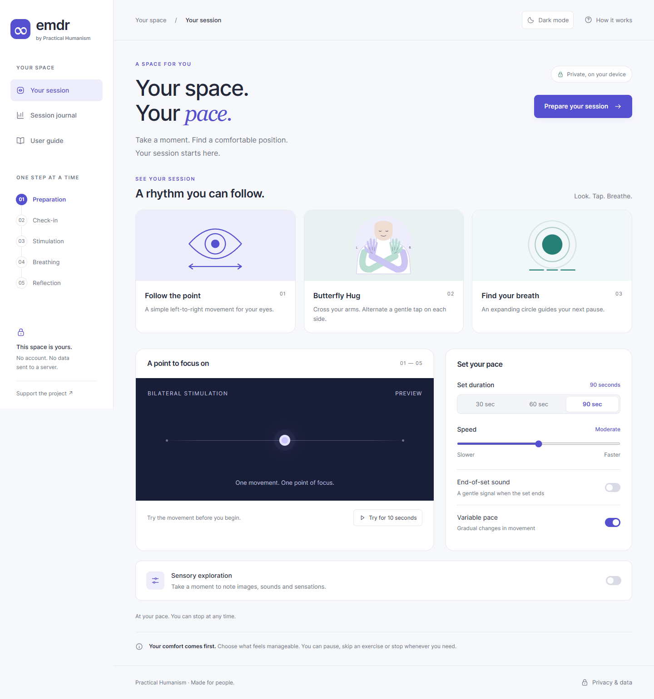

# EMDR — Practical Humanism

Ricostruzione dell’interfaccia di [fraterr/EMDRapp](https://github.com/fraterr/EMDRapp), con percorso in inglese, controlli espliciti e dati locali.

## Avvio

Richiede Node.js 20 o superiore. Per aprire l’app non occorre installare dipendenze:

```sh
npm start
```

Apri `http://127.0.0.1:5178`. La porta può essere cambiata con la variabile `PORT`.
L’app è statica: i file pubblici possono anche essere ospitati su GitHub Pages. Il workflow incluso prepara solo i file destinati al browser. La pubblicazione su GitHub Pages viene eseguita dal workflow dopo un aggiornamento di `main`.

## Funzioni

- Interfaccia interamente in inglese, incluse istruzioni, etichette accessibili, diario e messaggi.
- Tema chiaro/scuro tramite il pulsante in alto: inizialmente segue il sistema, poi salva la scelta in `emdr_theme`. Il cambio tema non interrompe il set.

- Preparazione, valutazione del disagio da 1 a 10, stimolazione, respirazione e riepilogo.
- Anteprima di 10 secondi, durata del set di 30/60/90 secondi, cinque velocità, ritmo costante o variabile, segnale audio opzionale.
- Pausa/ripresa, schermo intero ove supportato, arresto automatico quando la pagina diventa nascosta. Nessun avvio automatico del movimento.
- Note sensoriali facoltative e navigabili, nove punti di tapping illustrati, sequenza 9 Gamut e visualizzazione facoltativa. Butterfly Hug con passaggio dedicato, illustrazione delle braccia incrociate, prova del ritmo e guida alternata durante il set. La prova non consuma il tempo del set; la guida può essere disattivata.
- Panoramica illustrata del percorso, preparazione con pittogrammi, indicatore visivo del disagio e scene per la visualizzazione.
- Diario degli ultimi 20 set con grafico, tabella, cancellazione e compatibilità con i record precedenti.
- Layout responsive, etichette accessibili, navigazione da tastiera, focus gestito e rispetto di `prefers-reduced-motion` per la respirazione. Il movimento essenziale del punto rimane disponibile solo su avvio esplicito.

Il progetto mantiene gli esercizi complementari della versione originale e li presenta come facoltativi. Le valutazioni sono soggettive e non attestano un risultato clinico. I testi non promettono di cancellare ricordi. La ricostruzione non costituisce una validazione clinica del percorso.

## Privacy

Nessun account, analytics, font esterno o chiamata di rete dell’app verso servizi terzi. I link di sostegno aprono siti esterni solo su richiesta dell’utente.

Le note sensoriali restano nella memoria della pagina e vengono scartate alla conclusione o alla chiusura. Il diario usa la chiave preesistente `emdr_session_history` in `localStorage`, conserva solo data e punteggi e non è cifrato. Le descrizioni eventualmente salvate dalla versione precedente vengono eliminate al prossimo salvataggio del diario. Il salvataggio non disponibile viene segnalato; i dati restano utilizzabili in memoria durante la pagina corrente.

Il diario dipende dall’origine: quello del sito GitHub Pages non è automaticamente disponibile nell’anteprima localhost. Cambiare browser o cancellarne i dati rimuove l’accesso al diario locale.

## Sviluppo e verifiche

```sh
npm ci
npm run check
npm test
npm run format
```

I test usano Microsoft Edge su Windows. Negli altri sistemi usano Chromium, installabile con `npx playwright install chromium`. Il canale si può scegliere tramite `BROWSER_CHANNEL` (ad esempio `chromium`, `chrome` o `msedge`). Il server dei test sceglie una porta libera e si arresta al termine.

Le dipendenze sono solo di sviluppo: Playwright per i test e Prettier per la formattazione. Nessun framework o libreria viene scaricato dal browser per usare l’app.

- `index.html`: struttura principale e navigazione.
- `styles.css`: identità visiva, componenti e responsive.
- `app.js`: stato della sessione, viste, timer e persistenza locale.
- `server.cjs`: anteprima locale limitata ai file pubblici.
- `tests/app.test.cjs`: verifiche del percorso e dei casi limite.
- `docs/ANALISI.md`: analisi, scelte e risultati misurati.

## Anteprime



[Anteprima mobile](docs/mobile.png)

## Aggiornamento del 24 settembre 2026

Rimossi i riferimenti al terapista dai testi dell’app. Ripristinato il Butterfly Hug come passaggio illustrato prima della stimolazione, con pausa tramite pulsante, Esc e cambio scheda. Aggiunta una guida alternata durante il set, indipendente dalla velocità del punto. Il ritorno alle istruzioni conserva il tempo trascorso. Verifiche: 12 test browser, inclusi entrambi i temi, viewport da 320 a 1440 px e riduzione del movimento.
